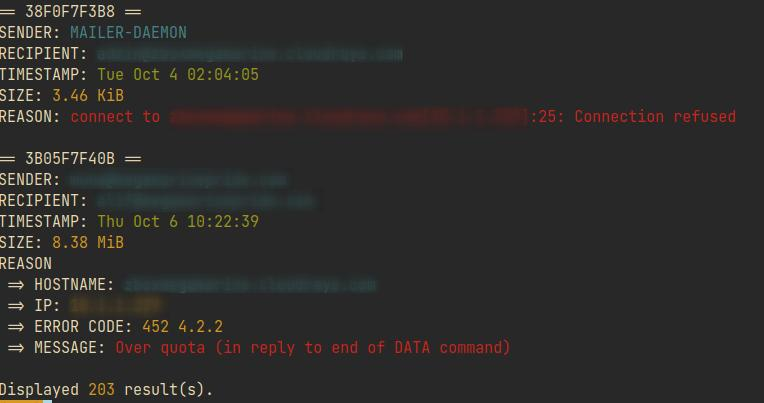

# mq.sh - Postfix's Mailq Parser



## Installation

Put both `mq.sh` and `parser.awk` in:

```
/opt/mailq-parser/bin

and

/opt/mailq-parser/lib
```

respectively.

Then add `/opt/mailq-parser/bin` to your `PATH`.
